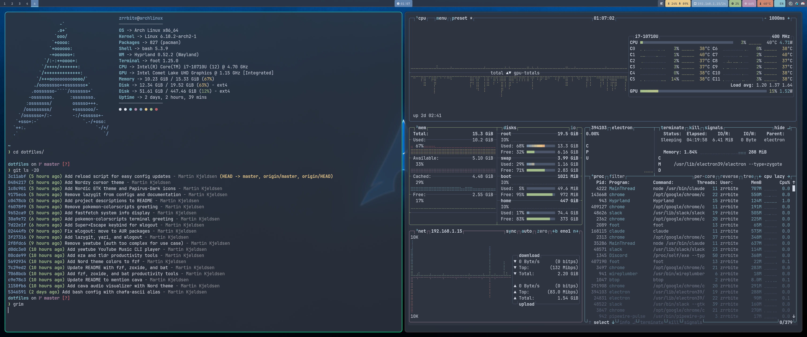

# Dotfiles

🎨 Cross-platform Nord-themed dotfiles • Arch Linux + WSL + macOS • Developer-focused • Stow-managed

Personal dotfiles supporting Arch Linux (with Hyprland), WSL (CLI-only), and macOS, managed with GNU Stow for easy deployment and version control.

## About

**One-liner:**
> Personal Arch Linux dotfiles with a Nord-themed Hyprland setup, managed with GNU Stow for easy deployment and version control.

**Short (elevator pitch):**
> A comprehensive dotfiles repository for Arch Linux featuring a beautiful Nord-themed Hyprland desktop environment. Everything is managed with GNU Stow and includes an automated install script. It's optimized for C++ development with neovim, clang tools, and gdb-dashboard, plus tons of productivity tools like fzf, zoxide, bat, and yazi. The whole setup is designed to be reproducible - clone the repo, run one script, and you're up and running.

**Detailed:**
> My personal Arch Linux configuration managed as a dotfiles repository using GNU Stow. It features a Nord-themed Hyprland compositor setup with waybar, rofi, and mako notifications. The repository includes configs for development tools (neovim with LSP, gdb-dashboard, clang-format/tidy), productivity utilities (fzf, zoxide, bat, eza, yazi), and visual enhancements (cava audio visualizer, wlogout menu, fastfetch system info). Everything is automated with an install script that handles package installation, config deployment, and shell integration. It's designed to be completely reproducible - perfect for quickly setting up a new machine or sharing configurations across systems.

---

**Note:** If you prefer a pre-configured Hyprland distro over building your own, check out [Omarchy](https://omarchy.org/) - an opinionated Linux distribution by DHH (Rails creator) that's also built on Hyprland. This dotfiles approach gives you more control and customization, while Omarchy provides an out-of-the-box experience.

Want to try Omarchy? See `./install_omarchy.sh` for installation guidance and instructions on layering these dotfiles on top.

---

## Quick Install

### Arch Linux (native with Hyprland)

```bash
git clone https://github.com/zrrbite/dotfiles.git ~/dotfiles
cd ~/dotfiles && ./install_arch.sh
```

The install script will:
- Install all packages via pacman and AUR
- Backup any existing configs to `~/.config-backup-TIMESTAMP/`
- Stow all packages
- Setup Hyprland compositor
- Enable audio (pipewire)

Then log out and select Hyprland as your session.

### WSL (Ubuntu/Debian) - CLI Only

```bash
git clone https://github.com/zrrbite/dotfiles.git ~/dotfiles
cd ~/dotfiles && ./install_wsl.sh
```

Installs CLI development tools only (no GUI/Wayland):
- Modern CLI utilities (fzf, bat, ripgrep, fd, eza, zoxide, duf, git-delta, procs)
- Dev tools (neovim, git, clang, gdb)
- Starship prompt

### macOS (M1/M2/Intel)

```bash
git clone https://github.com/zrrbite/dotfiles.git ~/dotfiles
cd ~/dotfiles && ./install_darwin.sh
```

Installs via Homebrew:
- All CLI tools from WSL setup
- Alacritty terminal with Nord theme
- Platform-specific tools (lldb instead of gdb)

## Updating Your Config

Pull the latest changes and reload everything:

```bash
cd ~/dotfiles && ./reload.sh
```

This will:
- Pull latest changes from git
- Re-stow all packages (picks up new files)
- Reload Hyprland config
- Reload waybar
- Source bashrc for current terminal

## What's Included

- **Desktop**: Hyprland, waybar, rofi, mako notifications, wlogout (logout menu), Nordic GTK theme, Papirus-Dark icons, Nordzy cursors
- **Terminal**: foot with Nord theme, starship prompt, fastfetch (system info)
- **Audio**: pipewire + wireplumber, pavucontrol, cava (audio visualizer)
- **Media**: mpv (video), imv (images), zathura (PDF)
- **Files**: thunar, mc (Midnight Commander), yazi (modern file manager)
- **Communication**: Discord, Delta Chat
- **Dev**: neovim, gdb + gdb-dashboard, clang-format, clang-tidy, TeX Live (beamer)
- **Fonts**: JetBrains Mono Nerd, CJK (Chinese/Japanese/Korean), emoji
- **Utils**: screenshots (grim + slurp + satty), screen recording (wf-recorder), clipboard history, screen lock, chafa (terminal images), fzf (fuzzy finder), zoxide (smart cd), bat (cat with syntax highlighting), eza (modern ls), tldr (simplified man pages)
- **Idle**: Lock at 5min, display off at 10min, suspend at 30min (hypridle)

## Screenshots

### Terminal with Fastfetch


## Default Applications

The `mimeapps` package sets default applications:

| Type | Application |
|------|-------------|
| Browser | Google Chrome |
| Images | imv |
| Video | mpv |
| PDF | zathura |

## Key Bindings

| Binding | Action |
|---------|--------|
| `Super + Q` | Terminal (foot) |
| `Super + E` | File manager (thunar) |
| `Super + Shift + E` | Midnight Commander |
| `Super + R` | App launcher (rofi) |
| `Super + C` | Close window |
| `Super + L` | Lock screen |
| `Super + Escape` | Logout menu (wlogout) |
| `Super + Shift + V` | Clipboard history |
| `Super + Shift + S` | Screenshot region |
| `Super + Shift + A` | Screenshot with annotation (satty) |
| `Super + Shift + C` | Screenshot to clipboard |
| `Super + Shift + R` | Toggle screen recording |
| `Super + Ctrl + R` | Toggle region recording |
| `Super + B` | Next window below (vertical) |
| `Super + N` | Next window right (horizontal) |
| `Super + J` | Toggle split direction |
| `Super + =` | Resize window to 1:1 aspect ratio (square) |
| `Super + F1` | Show all keybinds |
| `Super + F2` | Useful commands menu |
| `Super + F3` | Neovim keybindings |

## Manual Installation

If you prefer to install selectively:

```bash
git clone https://github.com/zrrbite/dotfiles.git ~/dotfiles
cd ~/dotfiles
stow foot      # just terminal
stow hypr      # just hyprland
stow */        # everything
```

## Packages

| Package | Description |
|---------|-------------|
| `btop`  | System monitor (Nord theme) |
| `cava`  | Audio visualizer with Nord gradient theme |
| `clang` | clang-format (LLVM style) and clang-tidy (modern C++ checks) |
| `gdb`   | GDB debugger config - gdb-dashboard, pretty printing, custom commands |
| `discord` | Desktop entry override for native Wayland support |
| `fastfetch` | System info display with Nord colors (Arch logo, system stats) |
| `foot`  | Foot terminal emulator - Nord theme, transparency, padding |
| `git`   | Git config with extensive aliases + global hooks for C++ and TypeScript |
| `gtk`   | GTK theme config - Nordic theme with Papirus-Dark icons for all GUI apps |
| `hypr`  | Hyprland compositor + hyprpaper + hyprlock + hypridle + cliphist |
| `mako`  | Notification daemon (Nord theme) |
| `mimeapps` | Default applications (Chrome, imv, mpv, zathura) |
| `nvim`  | Neovim IDE setup - LSP, treesitter, telescope (C++ focused) |
| `rofi`  | App launcher with Nord theme |
| `starship` | Minimal shell prompt with Nerd Font icons |
| `waybar`| Status bar with workspaces, clock, system info (Nord theme) |
| `wlogout` | Logout menu with Nord theme (lock, logout, shutdown, reboot, suspend) |

## GDB Debugging

The gdb config includes [gdb-dashboard](https://github.com/cyrus-and/gdb-dashboard) for a visual debugging interface showing source, assembly, variables, stack, and registers.

### Dashboard Commands

```bash
dashboard                          # Show current layout
dashboard -enabled off             # Disable (vanilla gdb)
dashboard -layout source stack     # Customize panels
dashboard source -style height 30  # Resize a panel
```

### Custom GDB Commands

| Command | Description |
|---------|-------------|
| `pa <arr> <len>` | Print raw array |
| `pv <vector>` | Print std::vector contents |
| `pm <map>` | Print std::map contents |
| `pl <head>` | Print linked list |
| `btall` | Backtrace all threads |
| `bpl` / `bpc` | List / clear breakpoints |
| `ctx` | Show source context at PC |

Project-local `.gdbinit` files are auto-loaded from `~/dev/`.

## Clang Tools

The `clang` package provides `.clang-format` and `.clang-tidy` configs in your home directory. Tools automatically find these when run from any subdirectory.

**clang-format style:**
- C++20, 120 column limit, 4-space indent
- Allman brace style (braces on new line)
- Left-aligned pointers (`int* ptr`)
- Sorted includes with grouping

**clang-tidy checks:** modernize, bugprone, performance, readability, cppcoreguidelines

**Automatic formatting enforcement:**
A global pre-commit hook automatically checks C++ code formatting before every commit. If staged C++ files don't comply with `.clang-format`, the commit is blocked with clear instructions to fix.

### Command Line

```bash
# Format a single file (in-place)
clang-format -i src/main.cpp

# Format all C++ files in a directory
find src -name '*.cpp' -o -name '*.hpp' | xargs clang-format -i

# Check formatting without modifying (CI/pre-commit)
clang-format --dry-run --Werror src/*.cpp

# Run clang-tidy on a file (needs compile_commands.json)
clang-tidy src/main.cpp

# Run clang-tidy and apply fixes
clang-tidy -fix src/main.cpp

# Run on entire project
find src -name '*.cpp' | xargs clang-tidy
```

### Generate compile_commands.json

clang-tidy needs a compilation database:

```bash
# CMake (recommended)
cmake -B build -DCMAKE_EXPORT_COMPILE_COMMANDS=ON
ln -s build/compile_commands.json .

# Bear (wrap any build system)
bear -- make
```

## Git Hooks (C++ and TypeScript Support)

Global git hooks that automatically enforce quality standards for both C++ and TypeScript/JavaScript projects.

**Hook Architecture:**
- **Location:** `~/.git-hooks/` (applies to all repositories globally)
- **Auto-detection:** Hooks detect project type and run appropriate checks
- **Cross-platform:** Pure bash - works on Linux/Mac/Windows (Git Bash)

### Hook Files

| Hook | Purpose |
|------|---------|
| `pre-commit` | Main hook - detects C++ or TypeScript, runs formatting check |
| `pre-commit-ts` | Helper - TypeScript formatting (npm run format:check) |
| `pre-push` | Main hook - detects C++ or TypeScript, runs quality checks |
| `pre-push-ts` | Helper - TypeScript type-check, lint, and tests |

### For C++ Projects

**Pre-commit (Formatting):**
- Runs `git-clang-format` on all staged C++ files
- Blocks commit if code doesn't comply with `.clang-format`
- Shows table-flipping ASCII art (`(╯°□°)╯︵ ┻━┻`) with diff

**Pre-push (Static Analysis):**
- Runs `clang-tidy` on changed C++ files in commits being pushed
- Catches bugs, performance issues, and style violations
- Blocks push if critical issues found

**When pre-commit blocks (formatting):**
```bash
# Option 1: Auto-fix with git cf alias (fastest)
git cf        # Formats all staged C++ files
git commit    # Try again

# Option 2: Auto-fix manually
git clang-format --staged
git add -u
git commit

# Option 3: Bypass hook (not recommended)
git commit --no-verify
```

**When pre-push blocks (clang-tidy):**
```bash
# Fix the reported issues, then:
git push      # Try again

# Bypass (not recommended):
git push --no-verify
```

### For TypeScript/JavaScript Projects

**Pre-commit (Formatting):**
- Detects: Staged `.ts`, `.tsx`, `.js`, `.jsx` files + `package.json` exists
- Runs: `npm run format:check` (works with Prettier or oxfmt)
- Blocks commit if formatting issues found

**Pre-push (Quality Gates):**
- Detects: `package.json` AND `tsconfig.json` exist
- Runs sequentially:
  1. Type checking: `npm run type-check`
  2. Linting: `npm run lint`
  3. Tests: `npm run test:run` (if script exists)
- Blocks push if any check fails

**When TypeScript pre-commit blocks:**
```bash
npm run format    # Auto-format all files
git add .
git commit
```

**When TypeScript pre-push blocks:**
```bash
# Fix the specific issue shown, then:
npm run type-check   # Verify types pass
npm run lint         # Verify linting passes
npm run test:run     # Verify tests pass
git push
```

### Configuration

**Git alias available:**
- `git cf` - Formats all staged C++ files (defined in `.gitconfig`)

**Setup:**
- Hook location: `~/.git-hooks/`
- Git config: `core.hooksPath = ~/.git-hooks`
- Applies to all your git repositories globally
- C++ uses `~/.clang-format` and `~/.clang-tidy`
- TypeScript uses npm scripts (tool-agnostic)

### VS Code with clangd

Install the [clangd extension](https://marketplace.visualstudio.com/items?itemName=llvm-vs-code-extensions.vscode-clangd) (disable Microsoft C/C++ IntelliSense).

clangd automatically uses your `.clang-format` and `.clang-tidy` configs. Add to `.vscode/settings.json`:

```json
{
    "clangd.arguments": [
        "--background-index",
        "--clang-tidy",
        "--header-insertion=iwyu"
    ],
    "editor.formatOnSave": true,
    "[cpp]": {
        "editor.defaultFormatter": "llvm-vs-code-extensions.vscode-clangd"
    }
}
```

### Neovim with clangd

The `nvim` package includes a full C++ IDE setup with clangd LSP, Telescope, and Treesitter.

**Symbol Navigation:**
```bash
Space + fs              # Find symbols in current file
Space + fw              # Find symbols in entire workspace (functions, classes, variables)
Space + fm              # Find macros (#define statements)
Space + fg              # Search text across all files (grep)
gd                      # Go to definition
gD                      # Go to declaration
gr                      # Go to references (find all usages)
gI                      # Go to implementation
K                       # Show documentation/hover info
Space + h               # Switch between header/source (.h <-> .cpp)
```

**Code Intelligence:**
```bash
Space + rn              # Rename symbol across project
Space + ca              # Code actions (suggestions/fixes/generate definition)
Space + cf              # Batch fix with clang-tidy (auto-fix all warnings)
Space + F               # Format code with clang-format
Space + D               # Go to type definition
Space + sh              # Signature help
Space + fd              # Show diagnostics (errors/warnings)
```

**File Navigation:**
```bash
Space + e               # Toggle file tree (neo-tree)
Space + ff              # Find files (Telescope)
Space + fb              # Find open buffers
Ctrl + h/j/k/l          # Navigate between splits
```

**Git Integration:**
```bash
Space + gb              # Toggle inline git blame (shows author/date for each line)
Space + hb              # Show full blame for current line
Space + hp              # Preview git hunk (shows diff in popup)
Space + hs              # Stage hunk (add changes to git)
Space + hr              # Reset hunk (discard changes)
Space + hd              # Show diff for current file
]c / [c                 # Jump to next/previous changed hunk
```

**Setup for C++ projects:**
1. Open project: `nvim .`
2. Generate `compile_commands.json` for best results (see above)
3. LSP activates automatically when you open `.cpp` or `.hpp` files
4. Use `Space + fw` to fuzzy search any symbol in your project!

**Diagnostics & Auto-fix Workflow:**

Clangd shows errors and warnings in the sign column (left side) with E/W markers.

```bash
# View diagnostics:
Space + q               # List all diagnostics with full text
Space + d               # Show diagnostic at cursor in popup
K                       # Hover on line - shows diagnostic

# Navigate diagnostics:
]d                      # Jump to next diagnostic
[d                      # Jump to previous diagnostic

# Auto-fix issues:
Space + ca              # Code actions - shows available fixes
                        # Select fix and press Enter to apply
```

**Common auto-fixes:**
- Remove unused variables
- Add missing includes
- Apply clang-tidy suggestions
- Modernize C++ code (use auto, range-for, etc.)

**Workflow for fixing multiple issues:**

*Option 1: Batch fix (fastest)*
1. `Space + cf` - Run clang-tidy --fix on current file
2. Wait for notification "clang-tidy fixes applied"
3. File auto-reloads with all auto-fixable warnings resolved

*Option 2: Manual fix (more control)*
1. `Space + q` - See all diagnostics
2. Navigate to one with "Fix available"
3. Press `Enter` to jump to line
4. `Space + ca` - View and apply fix
5. Repeat for other issues

**C++ Tips & Tricks:**

*Generate function implementation:*
1. In `.h` file, write function declaration: `void myFunction(int x);`
2. Put cursor on function name
3. `Space + ca` → Select "Define in..." or "Generate definition"
4. Implementation automatically created in `.cpp` file

*Find macros:*
- Use `Space + fm` to search for all `#define` macros
- Macros don't show in `Space + fw` (LSP symbols) because they're preprocessor directives

*Reduce warning noise:*
- Edit `~/.clang-tidy` to disable specific checks
- Add `-check-name,` to the Checks list
- Example: `-readability-make-member-function-const,` to disable const suggestions
- Restart nvim after changing `.clang-tidy`

*clangd vs clang-tidy:*
- **clangd** = LSP server providing IDE features (the main tool)
- **clang-tidy** = Static analysis tool (runs inside clangd via `--clang-tidy` flag)
- `Space + cf` runs standalone clang-tidy for batch fixes
- `Space + ca` uses clangd code actions (can fix more than just clang-tidy warnings)

**C++ Debugging with DAP:**

Neovim includes full debugging support via DAP (Debug Adapter Protocol) with codelldb.

```bash
# Debug Controls
F5                      # Start debugging / Continue execution
F10                     # Step over (execute current line)
F11                     # Step into (enter function)
F12                     # Step out (exit function)
Space + b               # Toggle breakpoint on current line
Space + B               # Set conditional breakpoint
Space + du              # Toggle debug UI (shows variables, stack, etc.)
Space + dr              # Open debug REPL (evaluate expressions)
```

**Debugging workflow:**
1. Compile your program with debug symbols (`-g` flag)
2. Open source file in nvim
3. Set breakpoints with `Space + b`
4. Press `F5` to start debugging
5. Enter path to executable when prompted
6. Debug UI opens automatically showing:
   - Variables and their values (updates as you step)
   - Call stack
   - Breakpoints list
   - Watch expressions
7. Step through code with F10/F11/F12
8. Hover over variables to see values
9. Use debug REPL (`Space + dr`) to evaluate expressions

**Debug configurations:**
- Launch: Run executable from nvim
- Attach: Attach to running process (pick from list)
- Works with C, C++, and Rust

**Unreal Engine C++ Development Workflow:**

Neovim works excellently for UE C++ development with this hybrid workflow:

*Setup (one-time):*
1. **Generate compile_commands.json** for LSP support:
   ```bash
   # Option 1: Via UnrealBuildTool (recommended)
   UnrealBuildTool.exe -Mode=GenerateClangDatabase -Project="C:/Path/To/YourProject.uproject" -Game -Engine

   # Option 2: Via RunUAT
   <UERoot>/Engine/Build/BatchFiles/RunUAT.bat -ScriptsForProject=<YourProject>.uproject Turnkey -command=VerifySdk -platform=Win64
   ```

2. **Create `.clangd` file** in project root to help with UE macros:
   ```yaml
   CompileFlags:
     Add:
       - -ferror-limit=0
       - -Wno-unknown-attributes
     Remove:
       - -W*
       - /W*
   ```

*Daily workflow:*
1. **C++ coding** → Neovim (LSP, refactoring, navigation, formatting)
2. **Compilation** → Visual Studio on Windows or UE Editor
3. **Blueprints/Assets** → Unreal Editor
4. **Debugging** → Neovim DAP (attach to UE Editor) or Visual Studio

*Debugging UE in Neovim:*
```bash
# Method 1: Attach to running Editor (recommended for iteration)
1. Start UE Editor normally
2. In nvim: Press F5 → "Attach to process"
3. Select UE4Editor.exe or UE5Editor.exe
4. Set breakpoints (Space+b) in your game code
5. Play in editor - breakpoints hit automatically
6. Step through with F10/F11

# Method 2: Launch game build
1. Build project in Development mode
2. In nvim: Press F5 → "Launch file"
3. Point to YourGame.exe
4. Breakpoints work in game code
```

*Why this workflow works:*
- ✅ Fast C++ editing with full IDE features (Neovim)
- ✅ Reliable compilation (VS/UE Build System)
- ✅ Visual tooling for Blueprints/Assets (UE Editor)
- ✅ Powerful debugging (Neovim DAP or VS)
- ✅ Best of all worlds - use the right tool for each job

Press `Super + F3` for a quick reference of all Neovim keybindings.

## Productivity Tools

### fzf - Fuzzy Finder

Interactive fuzzy search for command history, files, and more:

- `Ctrl+R` - Search command history
- `Ctrl+T` - Search files in current directory
- `Alt+C` - cd into a directory

### zoxide - Smart Directory Jumper

Tracks your most-used directories and jumps to them with partial matches:

```bash
z dot        # jumps to ~/dotfiles
z dev osm    # jumps to ~/dev/osm-raylib
zi           # interactive selection with fzf
```

Learns your habits over time - the more you `cd` somewhere, the higher it ranks.

### bat - Better cat

Syntax highlighting, line numbers, and git integration:

```bash
bat file.cpp           # view with syntax highlighting
bat -p file.cpp        # plain output (no line numbers)
bat file.cpp file.h    # view multiple files
```

### eza - Modern ls

Replaces `ls` with a modern alternative featuring colors, icons, and git status:

```bash
ls              # eza with icons (replaces standard ls)
ll              # detailed list with icons and git status
la              # list all files with icons
lt              # tree view (respects .gitignore)
eza -T -L 2     # tree view, 2 levels deep

# Use original ls if needed:
/bin/ls         # standard ls command
```

### tldr - Simplified Man Pages

Quick examples instead of full documentation:

```bash
tldr tar        # shows common tar examples
tldr git-log    # git log usage examples
tldr -u         # update cache (run once after install)
```

### yazi - Modern File Manager

Fast file manager with image previews and vim-like navigation:

```bash
yazi            # launch in current directory
```

**Key bindings:**
- `hjkl` - Navigate (vim-style)
- `space` - Select files
- `y` - Copy
- `d` - Cut
- `p` - Paste
- `q` - Quit

### fd - Better Find

Modern, user-friendly alternative to `find` with intuitive syntax:

```bash
fd pattern              # Find files/dirs matching pattern
fd -H bashrc            # Include hidden files
fd -e cpp               # Find by extension
fd -t f pattern         # Only files (-t d for dirs)
fd '^install'           # Files starting with "install" (regex)
```

Fast, respects `.gitignore` by default, and has colored output.

### ripgrep (rg) - Better Grep

Blazing fast search tool for file contents:

```bash
rg "pattern"            # Search recursively from current dir
rg -i "PATTERN"         # Case insensitive
rg -l "term"            # Just list filenames with matches
rg -C 3 "pattern"       # Show 3 lines of context
rg -t sh "function"     # Only search .sh files
rg --hidden "config"    # Include hidden files
```

Much faster than grep, respects `.gitignore`, and has smart case sensitivity.

### chafa - Terminal Image Viewer

View images directly in the terminal:

```bash
chafa-ascii image.jpg   # ASCII art mode (alias)
chafa-block image.jpg   # Block characters (alias)
chafa image.png         # Full color mode
fimg                    # Find and preview images with fzf (alias)
```

Perfect for quickly previewing images without leaving the terminal. The `fimg` alias combines fd, fzf, and chafa for an interactive image browser.

### btop - System Monitor

Beautiful system monitor with Nord theme:

```bash
btop                    # Launch interactive monitor
```

Shows CPU, memory, disk, network, and processes with a gorgeous TUI.

### fastfetch - System Info

Fast system information display (runs on terminal startup):

```bash
fastfetch               # Show system info with Arch logo
```

Displays OS, kernel, packages, shell, DE/WM, and more.

### wlogout - Logout Menu

Graphical logout menu. Bind it in Hyprland:

```bash
wlogout         # show logout menu
```

Provides options for lock, logout, shutdown, reboot, and suspend.

### CLI Tools Quick Reference

**Pro Tip Aliases - Power user shortcuts:**
```bash
fcpp                    # Find and view C++ files (fd + fzf + bat)
ftodo                   # Find and edit TODOs (rg + fzf + nvim)
fmd                     # Find markdown files (fd + fzf)
ffunc                   # Find function definitions (rg + fzf + bat)
fimg                    # Find and preview images (fd + fzf + chafa)
```

**Search & Navigation:**
```bash
z dot                   # Jump to frequently used directory
zi                      # Jump with fzf picker
fd <pattern>            # Find files (better than find)
fd -H <pattern>         # Include hidden files
rg <pattern>            # Search file contents (better grep)
rg -l <pattern>         # List files containing pattern
```

**Keyboard Shortcuts:**
```bash
Ctrl+R                  # Search command history with fzf
Ctrl+T                  # Fuzzy find files
Alt+C                   # Fuzzy cd into directory
```

## Usage

```bash
cd ~/dotfiles

# Enable a package
stow <package>

# Remove a package's symlinks
stow -D <package>

# Re-stow (useful after adding files)
stow -R <package>

# Stow all packages
stow */
```

## Adding New Configs

1. Create the package directory mirroring the home structure:
   ```bash
   mkdir -p ~/dotfiles/nvim/.config/nvim
   ```

2. Move your config files:
   ```bash
   mv ~/.config/nvim/init.lua ~/dotfiles/nvim/.config/nvim/
   ```

3. Stow the package:
   ```bash
   cd ~/dotfiles && stow nvim
   ```

4. Commit:
   ```bash
   git add -A && git commit -m "Add nvim config"
   ```
